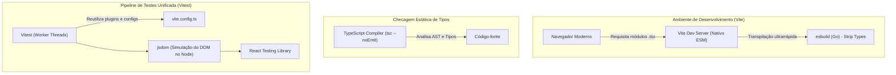

# 01. Setup Inicial: Vite, React, TypeScript e Vitest

Bem-vindo ao primeiro passo prático da nossa jornada de engenharia de software frontend.

Antes de escrever qualquer linha de regra de negócio, precisamos de uma **infraestrutura de desenvolvimento sólida, rápida e tipada**. Neste documento, não vamos apenas executar comandos cegamente; vamos entender **o papel de cada ferramenta** no ecossistema moderno e por que essa stack foi escolhida.

---

## 1. Compreendendo a Toolchain: Por que essa Stack?



### 1.1. Vite vs. Bundlers Tradicionais (Webpack / Create React App)
No passado, ferramentas como Webpack empacotavam (*bundle*) toda a aplicação em memória antes de subir o servidor local. Em projetos médios ou grandes, isso causava lentidão no início do servidor e no Hot Module Replacement (HMR).

O **Vite** adota uma abordagem revolucionária:
1. **ES Modules Nativos no Browser:** O navegador requisita os arquivos conforme são necessários.
2. **`esbuild` para Desenvolvimento:** Escrito em Go, o `esbuild` transcompila TypeScript/JSX de 10 a 100 vezes mais rápido que compiladores baseados em Node.js (como Babel ou `tsc`).
3. **Rollup para Produção:** Na hora do build final, ele gera pacotes altamente otimizados com *tree-shaking* avançado.

### 1.2. O Papel do TypeScript com Vite: Transpilação vs. Type Checking
Um detalhe crucial que muitos desenvolvedores desconhecem:
> **O Vite NÃO checa tipos durante o desenvolvimento.**

O `esbuild` simplesmente **remove** as anotações de tipo (*type stripping*) do seu arquivo `.tsx` para gerar JavaScript puro no menor tempo possível. Se houver um erro de tipagem no seu código, o Vite continuará servindo a página sem quebrar.

Por essa razão, a checagem de tipos estática é delegada ao **TypeScript Compiler (`tsc`)** via script dedicado (`tsc --noEmit`), que valida toda a árvore de tipos sem gerar arquivos de saída.

### 1.3. Por que Vitest e não Jest?
Historicamente, configurar o **Jest** em projetos React com TypeScript e ESM era uma fonte constante de atrito (necessidade de `ts-jest` ou `babel-jest`, duplicação de configurações de aliases de path e lentidão para inicializar).

O **Vitest** foi criado pela mesma equipe do Vite e resolve isso:
- **Configuração Única:** Reutiliza o mesmo `vite.config.ts`, os mesmos plugins e aliases de importação.
- **Velocidade:** Executa testes em paralelo usando *Worker Threads*.
- **Compatibilidade:** Possui API quase idêntica à do Jest (`describe`, `it`, `expect`, `vi.fn()`), facilitando a transição.

---

## 2. Passo a Passo do Setup

### Passo 2.1: Inicialização do Projeto com Vite
Como já estamos dentro do diretório `/pomodoro`, podemos inicializar o template diretamente no diretório atual usando `.` (ponto):

```bash
npm create vite@latest . -- --template react-ts
```

> [!NOTE]
> Se o assistente perguntar se deseja ignorar ou mesclar arquivos existentes, certifique-se de manter os diretórios `agents/` e `docs/`.

Em seguida, instale as dependências base geradas pelo Vite:
```bash
npm install
```

---

### Passo 2.2: O Papel do Linter no Aprendizado (ESLint vs. Oxlint)

Enquanto o compilador do TypeScript (`tsc`) analisa a integridade dos **tipos** (impedindo que você passe `string` onde se espera `number`), o **Linter** analisa a integridade de **padrões de código, regras semânticas e arquitetura**.

#### ESLint vs. Oxlint: Qual o papel de cada um?

| Critério | ESLint | Oxlint (Rust / Oxc) |
| :--- | :--- | :--- |
| **Velocidade** | Razoável (Node.js/V8, single-thread). | **Ultrarrápido** (50x a 100x mais rápido em Rust multi-thread). |
| **Regras de React Hooks** | **Padrão ouro:** `react-hooks/exhaustive-deps` flagra Stale Closures e dependências omitidas. | Suporta regras básicas de hooks, mas ainda em evolução para edge cases. |
| **Auditoria a11y (WCAG)** | **Maduro:** `eslint-plugin-jsx-a11y` aponta falhas de acessibilidade no JSX em tempo real. | Suporte a regras de acessibilidade ainda é embrionário. |
| **Type-Aware Linting** | **Sim:** `@typescript-eslint` acessa os tipos para validar regras semânticas complexas. | Não possui checagem de tipos semântica completa ainda. |

> [!TIP]
> **Por que o ESLint é ideal para a nossa jornada de estudos?**  
> O template do Vite (`react-ts`) já traz o **ESLint moderno (Flat Config em `eslint.config.js`)** configurado de fábrica com `typescript-eslint` e `react-hooks`. As regras `rules-of-hooks` e `exhaustive-deps` atuam como um mentor constante no seu editor, prevenindo que você cometa erros com o ciclo de vida do React.
> 
> O **Oxlint** é uma ferramenta espetacular para ser usada em conjunto em grandes repositórios de produção (como filtro de menos de 50ms no *pre-commit*), mas para o aprendizado minucioso de React e Acessibilidade, o ecossistema do ESLint é imbatível.

#### Recomendação: Adicionar o Plugin de Acessibilidade (`eslint-plugin-jsx-a11y`)
Para reforçar a atuação do nosso agente **a11y Specialist**, podemos instalar o plugin oficial de acessibilidade:

```bash
npm install -D eslint-plugin-jsx-a11y
```

---

### Passo 2.3: Instalação da Suíte de Testes
Agora instalamos o Vitest e a biblioteca de testes comportamentais do React, além do ambiente simulado de DOM:

```bash
npm install -D vitest @testing-library/react @testing-library/jest-dom @testing-library/user-event jsdom
```

#### O que cada pacote faz?
- **`vitest`**: O test runner rápido e moderno integrado ao Vite.
- **`jsdom`**: Uma implementação puramente em JavaScript dos padrões web (DOM, HTML5, Window) para rodar testes no Node.js sem precisar abrir um navegador real.
- **`@testing-library/react`**: Utilitários para renderizar componentes React e consultar a árvore simulada a partir da perspectiva do usuário.
- **`@testing-library/jest-dom`**: Conjunto de matchers customizados para o `expect` (ex: `.toBeInTheDocument()`, `.toHaveAttribute()`, `.toBeDisabled()`).
- **`@testing-library/user-event`**: Simula eventos de usuário com fidelidade máxima (foco de teclado, clique, digitação real).

---

### Passo 2.4: Configuração do Vitest no `vite.config.ts`

Para que o Vite e o TypeScript reconheçam as opções do Vitest, ajustamos o arquivo `vite.config.ts`:

```typescript
/// <reference types="vitest" />
import { defineConfig } from 'vite';
import react from '@vitejs/plugin-react';

// https://vitejs.dev/config/
export default defineConfig({
  plugins: [react()],
  test: {
    globals: true,                  // Permite usar describe, it, expect sem importar em cada arquivo
    environment: 'jsdom',           // Simula o ambiente de navegador
    setupFiles: './src/setupTests.ts', // Arquivo de setup executado antes de cada suíte
    css: false,                     // Não processa CSS durante os testes (ganho expressivo de performance)
  },
});
```

> [!TIP]
> A linha de comentário especial `/// <reference types="vitest" />` no topo do arquivo é uma diretiva do TypeScript chamada *Triple-Slash Directive*. Ela ensina ao compilador que a interface de configuração do Vite foi estendida com a propriedade `test`.

---

### Passo 2.5: Arquivo de Setup Global dos Testes (`src/setupTests.ts`)

Crie o arquivo `src/setupTests.ts` para carregar os matchers semânticos do `@testing-library/jest-dom`:

```typescript
import '@testing-library/jest-dom';
```

Isso garante que asserções como:
```typescript
expect(buttonElement).toBeInTheDocument();
expect(inputElement).toBeDisabled();
```
estejam disponíveis globalmente em qualquer arquivo de teste sem imports repetitivos.

---

### Passo 2.6: Ajuste dos Tipos no `tsconfig.app.json` (ou `tsconfig.json`)

Templates recentes do Vite separam as configurações em `tsconfig.app.json` (código da aplicação) e `tsconfig.node.json` (arquivos de configuração do Vite).

Para que o TypeScript reconheça as funções globais do Vitest (`describe`, `test`, `expect`) e os tipos do `jest-dom`, adicione `"vitest/globals"` e `"@testing-library/jest-dom"` no array `compilerOptions.types`:

```json
{
  "compilerOptions": {
    "types": ["vitest/globals", "@testing-library/jest-dom"]
  }
}
```

---

### Passo 2.7: Scripts de Automação no `package.json`

Adicione os scripts no `package.json` para facilitar a execução no terminal:

```json
"scripts": {
  "dev": "vite",
  "build": "tsc -b && vite build",
  "lint": "eslint .",
  "preview": "vite preview",
  "test": "vitest run",
  "test:watch": "vitest",
  "test:coverage": "vitest run --coverage",
  "typecheck": "tsc --noEmit"
}
```

---

## 3. Teste de Sanidade (Smoke Test)

Para certificar que todo o ecossistema (Vite + React + TypeScript + Vitest + DOM Matchers) está funcionando harmoniosamente, criamos um teste simples de verificação.

Crie o arquivo `src/App.test.tsx`:

```tsx
import { render, screen } from '@testing-library/react';
import App from './App';

describe('App (Smoke Test de Configuração)', () => {
  it('deve renderizar o componente principal sem falhas', () => {
    render(<App />);
    // Consulta o elemento a partir da perspectiva do usuário via screen
    expect(screen.getByRole('heading', { level: 1 })).toBeInTheDocument();
  });
});
```

Ao rodar no terminal:
```bash
npm test
```
A suíte deve executar em menos de 1 segundo, reportando `1 passed`.

---

## 🧠 Perguntas de Engenharia para Fixação

1. **Por que utilizamos `vitest run` no script `"test"` e `vitest` no script `"test:watch"`?**  
   - **`vitest` (modo watch):** Ideal para o fluxo de desenvolvimento local (TDD). Ele ativa um observador no sistema de arquivos (*file watcher*) que reexecuta instantaneamente apenas os testes impactados por arquivos alterados. O processo permanece aberto e interativo no terminal.
   - **`vitest run` (execução única / single run):** Indispensável para pipelines automatizados de CI/CD (como GitHub Actions) e scripts de pré-commit. Ele executa toda a suíte uma única vez e encerra o processo devolvendo um código de saída (*exit code*): `0` se todos os testes passaram ou `1` (ou maior) se houver falhas. Se usássemos o modo interativo no CI, o pipeline ficaria travado aguardando entrada de teclado até atingir o tempo limite (*timeout*).

2. **Qual é a diferença de impacto entre `tsc --noEmit` e o build feito pelo Vite?**  
   - **O Vite (via `esbuild` / `rollup`):** É otimizado para velocidade extrema. Ele realiza *type stripping* (apenas remove a sintaxe de tipos do TypeScript sem validá-la semanticamente) para gerar os arquivos `.js`. Por conta disso, se rodarmos apenas `vite build`, **o build pode concluir com sucesso mesmo se o código tiver erros graves de tipagem**, enviando bugs para a produção.
   - **`tsc --noEmit`:** Executa o compilador oficial do TypeScript para inspecionar toda a árvore de tipos e garantir a integridade dos contratos do projeto. A flag `--noEmit` instrui o compilador a apenas relatar erros e não gerar arquivos compilados (já que o Vite se encarrega de gerar o bundle final).
   - **Por que usamos `"build": "tsc -b && vite build"`?** Essa composição cria uma barreira de proteção: o Vite só inicia o empacotamento se a checagem de tipos estática do `tsc` for aprovada sem nenhum erro.

3. **Por que o `jsdom` é necessário se já temos o Node.js rodando o teste?**  
   - **O Node.js não possui APIs Web nativas:** O Node.js é um ambiente voltado a servidor e sistema operacional (`fs`, `http`, `process`). Ele não contém nativamente objetos globais do navegador como `window`, `document`, `navigator`, nem classes como `HTMLElement` ou a hierarquia de eventos (`MouseEvent`, `KeyboardEvent`).
   - **O React e o Testing Library precisam do DOM:** Para montar componentes, registrar nós e simular interações do usuário, o `react-dom` e o `@testing-library/react` precisam de uma representação de documento ativa.
   - **O papel do `jsdom`:** Ele é uma implementação completa em JavaScript puro dos padrões Web (WHATWG DOM e HTML) que roda sobre o Node. Ele simula essa árvore de elementos na memória RAM sem exigir a abertura de um navegador real (como Chrome ou Firefox), tornando os testes unitários e de integração ultrarrápidos e leves.

---

## 🏁 Próximos Passos

Com o setup validado, o próximo passo do nosso plano ([`docs/PLAN.md`](file:///home/gustavo/Desktop/Projects/pomodoro/docs/PLAN.md#L76-L77)) será a **Lógica Utilitária**:
- Criação de `src/utils/formatTime.ts`.
- Prática de TDD (Test-Driven Development) escrevendo os testes em `formatTime.test.ts` antes da implementação.
