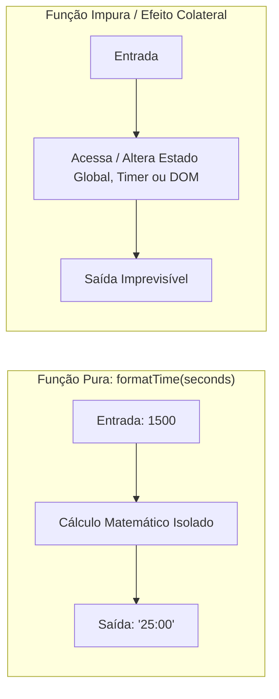
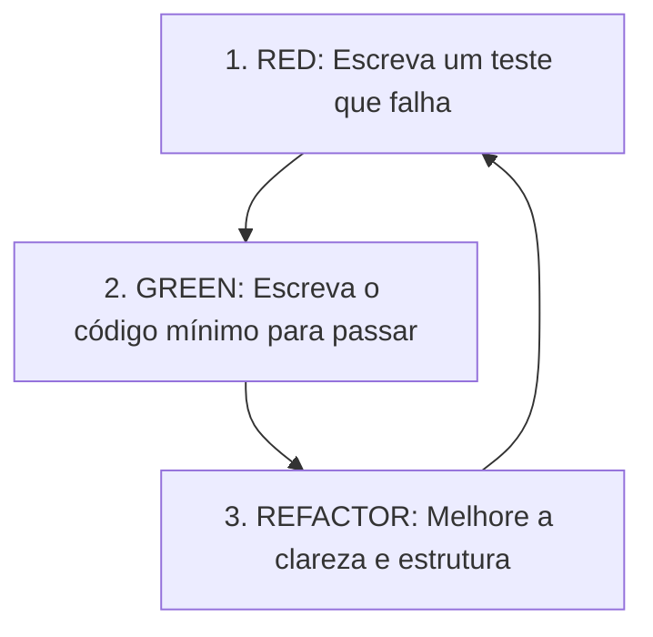

# 02. Lógica Utilitária e TDD: Funções Puras e Manipulação de Tempo

Bem-vindo ao segundo passo do nosso projeto Pomodoro.

Agora que nossa infraestrutura de desenvolvimento e testes está homologada, daremos início à construção do código da aplicação. Em vez de começar direto pela interface visual (UI) ou por hooks complexos, começaremos por uma **unidade isolada de regra de negócio**: a formatação do tempo.

Neste estudo, você aprenderá sobre **Funções Puras**, a disciplina de **Test-Driven Development (TDD)** e técnicas de manipulação de strings e números com TypeScript.

---

## 1. Fundamentos Arquiteturais

### 1.1. Funções Puras (Pure Functions)

Uma função é considerada **pura** quando atende a dois critérios fundamentais:
1. **Determinismo:** Dada a mesma entrada, ela **sempre** retornará a mesma saída.
2. **Ausência de Efeitos Colaterais (*No Side Effects*):** Ela não altera variáveis globais, não modifica argumentos recebidos, não grava no disco, não faz requisições de rede e não manipula o DOM.



#### Por que isolar a formatação em uma função pura?
* **Testabilidade Imediata:** Não requer simulação de DOM, renderização de componentes React ou mocks de timers.
* **Reutilização:** O mesmo formatador pode ser usado no display principal, no título da aba do navegador (`document.title`) ou em notificações sonoras/visuais.
* **Manutenibilidade:** Se a regra de exibição mudar (por exemplo, exibir horas `HH:MM:SS`), a alteração é feita em um único ponto isolado do sistema.

---

## 2. O Ciclo do TDD (Test-Driven Development)

O TDD inverte o fluxo tradicional de desenvolvimento: **escrevemos o teste antes do código de produção**.



### Os Três Passos do Ciclo:
1. 🔴 **Red (Vermelho):** Escreva um caso de teste que expresse o comportamento esperado. O teste deve falhar (ou nem compilar), provando que o comportamento ainda não existe.
2. 🟢 **Green (Verde):** Escreva a implementação mais direta e simples possível para fazer o teste passar. O objetivo aqui é resolver a especificação, não escrever uma obra de arte.
3. 🔵 **Refactor (Refatoração):** Com a rede de segurança dos testes passando, limpe o código, elimine duplicações, ajuste nomes de variáveis e garanta a legibilidade sem medo de quebrar a funcionalidade.

---

## 3. Anatomia de uma Suíte de Testes com Vitest

O Vitest oferece uma API compatível com Jest/Mocha organizada em blocos semânticos:

* **`describe(nome, callback)`:** Agrupa cenários de teste relacionados a uma mesma unidade ou contexto funcional.
* **`it(comportamento, callback)` (ou `test`):** Define um cenário de teste individual. A boa prática recomenda começar o texto com *"deve..."* descrevendo o resultado observado.
* **`expect(valorRecebido).toBe(valorEsperado)`:** Cria a asserção (*assertion*).

### `toBe` vs. `toEqual`: Qual usar?
* **`toBe`:** Checa igualdade por identidade estrita (`Object.is` / `===`). É ideal para valores primitivos (`string`, `number`, `boolean`).
* **`toEqual`:** Checa igualdade estrutural profunda (*deep equality*), percorrendo todas as propriedades de arrays ou objetos.

> [!TIP]
> Como nossa função utilitária recebe um número e retorna uma string primitiva, `toBe` é a escolha mais eficiente e precisa.

---

## 4. O Desafio Lógico: Convertendo Segundos em MM:SS

A conversão de segundos totais em um formato de relógio tradicional envolve duas operações aritméticas e uma formatação de texto:

### 4.1. Divisão Inteira para Minutos
Para saber quantos minutos inteiros cabem nos segundos fornecidos:
$$\text{minutos} = \lfloor \frac{\text{segundos}}{60} \rfloor$$
Em JavaScript/TypeScript, usamos `Math.floor(totalSeconds / 60)`.

### 4.2. Operador Resto (%) para Segundos
Para encontrar os segundos restantes que não completaram um minuto:
$$\text{segundos restantes} = \text{segundos} \pmod{60}$$
Em JavaScript/TypeScript, usamos `totalSeconds % 60`.

### 4.3. Preenchimento de Dois Dígitos (*Padding*)
Um número menor que 10 (como `5`) deve ser exibido como `"05"`, e não `"5"`.
Para isso, a linguagem oferece o método nativo [`String.prototype.padStart()`](https://developer.mozilla.org/pt-BR/docs/Web/JavaScript/Reference/Global_Objects/String/padStart):

```typescript
// Exemplo didático do método padStart:
const numero = 7;
const formatado = String(numero).padStart(2, '0'); // Resultado: "07"
```

---

## 5. Roteiro Prático de Execução

Siga o [fluxo de aprendizado](../DEV-FLOW.md) e pratique TDD passo a passo:

### Passo 1: Criar o Arquivo de Teste
Crie o arquivo `src/utils/formatTime.test.ts` e descreva os seguintes cenários:
* Conversão de tempos padrão de trabalho (ex: `1500` segundos $\rightarrow$ `"25:00"`).
* Conversão de tempos de intervalo curto (ex: `300` segundos $\rightarrow$ `"05:00"`).
* Conversão com minutos e segundos quebrados (ex: `65` segundos $\rightarrow$ `"01:05"`).
* Casos de borda com valores pequenos ou zero (ex: `9` segundos $\rightarrow$ `"00:09"` e `0` segundos $\rightarrow$ `"00:00"`).

### Passo 2: Ver o Teste Falhar (Fase Red)
Rode o Vitest no terminal:
```bash
npm test
```
O teste deve falhar indicando que o módulo ou a função `formatTime` ainda não existe.

### Passo 3: Implementar a Função (Fase Green)
Crie o arquivo `src/utils/formatTime.ts`.
* Declare e exporte a função tipando explicitamente o parâmetro de entrada (`seconds: number`) e o retorno (`: string`).
* Implemente os cálculos de minutos, segundos e a interpolação com `padStart`.
* Reexecute `npm test` até ver todos os cenários verdes.

### Passo 4: Limpeza e Checagens de Integridade
Execute o linter e o verificador de tipos:
```bash
npm run lint
npm run typecheck
```

---

## 🧠 Perguntas de Engenharia para Fixação

1. **Por que o TypeScript é especialmente valioso em funções utilitárias puras, mesmo quando parecem simples?**  
   *(Dica: o que aconteceria se acidentalmente passássemos `null`, `undefined` ou `"1500"` como string para essa função em tempo de execução?)*

2. **Como a função deveria se comportar se recebesse números com casas decimais (ex: `125.7` segundos)?**  
   *(Dica: relógios do tipo cronômetro normalmente descartam frações de segundo usando `Math.floor` antes do cálculo).*

3. **Qual a desvantagem de colocar essa lógica de cálculo diretamente dentro do JSX de um componente React em vez de isolá-la em um arquivo utilitário?**  
   *(Dica: pense em reutilização, testes unitários e legibilidade do componente visual).*

---

## 🏁 Próximos Passos

Com a lógica utilitária concluída e coberta por testes, o próximo passo do [plano do projeto](../PLAN.md) será:
* **Etapa 3:** Estruturação da **Lógica de Negócio e Estado** do Pomodoro (modos de foco/pausa, tempo restante e ações de controle).
