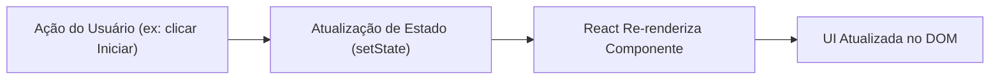
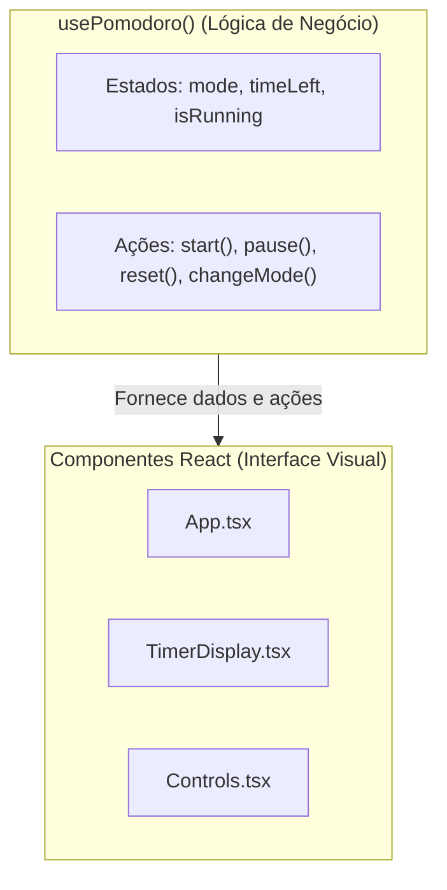

# 03. Estado e Regras de Negócio: Custom Hooks e Testes de Comportamento

Bem-vindo ao terceiro passo da nossa jornada no projeto Pomodoro.

Na etapa anterior, construímos uma função utilitária pura (`formatTime`). Agora, precisamos estruturar o **cérebro** do nosso aplicativo: o gerenciamento de estado e as regras de transição do temporizador Pomodoro.

Neste estudo, você aprenderá sobre **Estado no React**, a criação de **Custom Hooks** para isolar a lógica de negócio da interface visual, e como testar hooks de forma comportamental com `renderHook` e `act`.

---

## 1. Fundamentos Arquiteturais

### 1.1. O que é Estado (*State*) no React?

No React, estado representa os dados que mudam ao longo do tempo em resposta a ações do usuário ou eventos do sistema. Quando um estado é atualizado, o React agenda uma nova renderização (*re-render*) para sincronizar a interface visual com os novos dados.



### 1.2. O que é um Custom Hook?

Um **Custom Hook** é uma função JavaScript cujo nome começa obrigatoriamente com o prefixo `use` (como `usePomodoro`) e que tem a capacidade de invocar outros hooks do React (como `useState` e `useEffect`).

#### Por que extrair a lógica para um Custom Hook?
* **Separação de Responsabilidades (SoC):** Os componentes visuais (botões, títulos, displays) devem se preocupar apenas com **como as coisas são exibidas**. A lógica de contagem regressiva, regras de tempo e alternância de modos deve se preocupar com **como os dados se comportam**.
* **Reutilização e Testabilidade:** Um hook pode ser testado isoladamente sem a necessidade de simular cliques em elementos complexos do DOM.



---

## 2. Modelagem dos Dados e Estados

Antes de escrever código, analisamos quais informações o cronômetro precisa armazenar e quais ações ele deve oferecer.

### 2.1. Estados Necessários
1. **`mode` (Modo Atual):**
   * Pomodoro (Foco): 25 minutos (1500 segundos).
   * Pausa Curta (*Short Break*): 5 minutos (300 segundos).
   * Pausa Longa (*Long Break*): 15 minutos (900 segundos).
   * *Dica de TypeScript:* Em vez de usar uma `string` genérica, usamos um **Union Type Literal**: `'pomodoro' | 'shortBreak' | 'longBreak'`.
2. **`timeLeft` (Tempo Restante):**
   * Número inteiro representando a quantidade de segundos que faltam para o ciclo terminar.
3. **`isRunning` (Status do Timer):**
   * Booleano (`true` se o relógio está em contagem regressiva, `false` se está pausado/parado).

### 2.2. Ações (Transições de Estado)
* **`start()`:** Ativa a contagem (`isRunning = true`).
* **`pause()`:** Interrompe a contagem (`isRunning = false`), mantendo o `timeLeft` onde estava.
* **`reset()`:** Pausa o relógio e restaura o `timeLeft` para o valor inicial do modo ativo.
* **`changeMode(novoModo)`:** Altera o modo atual, pausa o relógio e redefine o `timeLeft` para o tempo correspondente ao novo modo.

> [!IMPORTANT]
> **Atenção ao escopo desta etapa:**  
> Neste momento, **não implementaremos o `setInterval` ainda**. Vamos focar exclusivamente nas **transições de estado** e suas regras. Fazer o tempo passar a cada 1 segundo será a etapa 6, depois que a interface estiver conectada.

---

## 3. Como Testar Hooks com `@testing-library/react`

Como hooks não são componentes React e não retornam JSX, não podemos testá-los com `render(<Component />)`. Para isso, a biblioteca Testing Library fornece utilitários específicos.

### 3.1. `renderHook`
O `renderHook` monta um componente invisível de teste que executa o hook e expõe o seu retorno através da propriedade `result.current`.

```typescript
// Exemplo conceitual:
const { result } = renderHook(() => usePomodoro());
expect(result.current.isRunning).toBe(false);
```

### 3.2. O Utilitário `act`
No React, qualquer chamada que provoque uma atualização de estado (*state change*) dentro do ambiente de testes deve ser envolvida na função `act(...)`:

```typescript
// Exemplo conceitual:
act(() => {
  result.current.start();
});

// Após o act, o React já processou o re-render:
expect(result.current.isRunning).toBe(true);
```

> [!NOTE]
> O `act` garante que todas as atualizações de estado e os efeitos pendentes do React sejam concluídos antes que o teste faça a asserção com o `expect`. Sem o `act`, o React emitirá alertas no console de avisos de atualizações não sincronizadas.

---

## 4. Roteiro Prático de Execução (TDD)

### Passo 1: Criar o Arquivo de Teste
Crie o arquivo `src/hooks/usePomodoro.test.ts`.

Descreva cenários de teste para os seguintes comportamentos esperados:
1. **Valores Iniciais:** Ao inicializar, o timer deve começar no modo `'pomodoro'`, com `timeLeft` igual a `1500` (25 minutos) e `isRunning` como `false`.
2. **Ação `start`:** Chamar `start()` deve alterar `isRunning` para `true`.
3. **Ação `pause`:** Após iniciar, chamar `pause()` deve alterar `isRunning` de volta para `false`.
4. **Ação `changeMode`:** Chamar `changeMode('shortBreak')` deve mudar o modo para `'shortBreak'`, ajustar o `timeLeft` para `300` segundos e garantir que o timer esteja pausado.
5. **Ação `reset`:** Se o tempo for modificado ou o timer estiver rodando, chamar `reset()` deve restaurar o tempo inicial do modo atual e pausar a execução.

### Passo 2: Executar e Ver Falhar (Fase Red)
Rode no terminal:
```bash
npm test
```
O Vitest deve acusar que o hook `usePomodoro` ainda não existe.

### Passo 3: Implementar o Hook (Fase Green)
Crie o arquivo `src/hooks/usePomodoro.ts`:
* Defina as tipagens (ex: o tipo literal para os modos).
* Crie os estados com `useState`.
* Implemente as funções `start`, `pause`, `reset` e `changeMode`.
* Retorne um objeto contendo os estados e as funções.
* Reexecute `npm test` até que todos os testes passem.

### Passo 4: Validação de Qualidade
Execute a suíte completa:
```bash
npm test
npm run lint
npm run typecheck
```

---

## 🧠 Perguntas de Engenharia para Fixação

1. **Por que é mais seguro usar `'pomodoro' | 'shortBreak' | 'longBreak'` em vez de `string` comum para o modo do timer?**  
   *(Dica: o que o TypeScript faz se alguém tentar chamar `changeMode('banana')` ou errar a digitação com `short_break`?)*

2. **Por que é uma boa prática agrupar os tempos padrão de cada modo em um objeto constante (como um mapa/dicionário) em vez de espalhar números mágicos pelo código?**  
   *(Dica: pense no que acontece se amanhã decidirmos que a pausa curta deve durar 3 minutos).*

3. **Qual é o risco de esquecer de envolver chamadas como `start()` ou `changeMode()` dentro de `act(...)` nos testes de hooks?**  
   *(Dica: o que acontece com a sincronização entre a atualização de estado do React e as asserções do `expect`?)*

---

## 🏁 Próximos Passos

Com a lógica de negócios e as transições de estado testadas e validadas:
* **Etapa 4:** Criaremos os **Componentes de UI** (`TimerDisplay`, `Controls`, `ModeSelector`), recebendo dados puramente via `props`.
