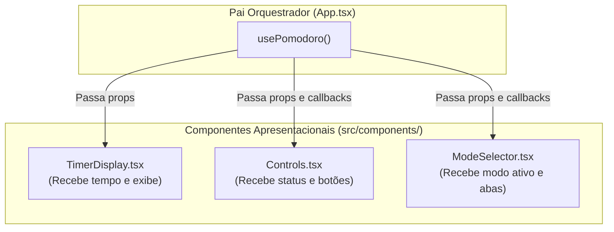

# 04. Interface de Usuário: Componentes Apresentacionais, Props e Testes de UI

Bem-vindo ao quarto passo do desenvolvimento do Pomodoro.

Até agora, construímos duas fundações sólidas:
1. Uma função utilitária pura de formatação (`formatTime`).
2. O cérebro de estado da aplicação (`usePomodoro`).

Agora daremos vida à **Interface Visual (UI)**. Em vez de jogar todo o JSX desordenado dentro do `App.tsx`, construiremos componentes isolados e especializados que recebem dados e funções através de **`props`**.

---

## 1. Fundamentos de Arquitetura de Componentes

### 1.1. Componentes Apresentacionais (*Presentational / Dumb Components*)

Em aplicações React escaláveis, costuma-se separar:
* **Lógica / Estado:** gerenciados em hooks ou stores (o que já fizemos no `usePomodoro`).
* **Apresentação / Visual:** componentes focados em **renderizar elementos visuais** e emitir eventos de interação.



#### Vantagens dessa abordagem:
* **Previsibilidade:** Dado o mesmo conjunto de props, o componente sempre renderiza a mesma interface.
* **Testabilidade extrema:** Testar um botão não exige configurar timers reais ou lógica complexa de contagem regressiva; basta passar um mock com `vi.fn()` e checar se ele foi chamado ao clicar.

---

## 2. Modelagem das Props com TypeScript

Para cada componente visual, definimos um contrato explícito de **Props** usando `interface` ou `type`.

### 2.1. Convenção de Nomes: `onEvent` vs. `handleEvent`
No ecossistema React, existe uma convenção amplamente adotada:
* **`on[Acao]`:** usado nas Props para nomear callbacks recebidos de fora (ex: `onStart`, `onPause`, `onReset`, `onSelectMode`).
* **`handle[Acao]`:** usado para funções internas do próprio componente que tratam eventos (ex: `handleClick`).

### 2.2. Proposta dos Três Componentes

#### A. `TimerDisplay` (`src/components/TimerDisplay.tsx`)
* **Responsabilidade:** Exibir o tempo do cronômetro em tamanho de destaque.
* **Decisão arquitetural de Props:**  
  * O componente pode receber o tempo em segundos brutos (`timeLeft: number`) e usar a sua função `formatTime(timeLeft)` para exibir `MM:SS`.
  * *Ou* pode receber diretamente o tempo já formatado (`formattedTime: string`).
  *(Receber `timeLeft: number` e chamar `formatTime` internamente mantém o componente flexível e autossuficiente).*

#### B. `Controls` (`src/components/Controls.tsx`)
* **Responsabilidade:** Renderizar os botões de ação:
  * Se `isRunning === false`: exibe o botão **Iniciar** (`onStart`).
  * Se `isRunning === true`: exibe o botão **Pausar** (`onPause`).
  * Botão **Resetar** (`onReset`): deve estar sempre acessível para recomeçar o ciclo.
* **Props esperadas:**
  * `isRunning: boolean`
  * `onStart: () => void`
  * `onPause: () => void`
  * `onReset: () => void`

#### C. `ModeSelector` (`src/components/ModeSelector.tsx`)
* **Responsabilidade:** Renderizar os botões ou abas para alternar entre os três modos:
  * Pomodoro (25 min)
  * Pausa Curta (5 min)
  * Pausa Longa (15 min / 10 min)
* **Props esperadas:**
  * `currentMode: Mode`
  * `onSelectMode: (mode: Mode) => void`
  * Destaque visual no botão do modo ativo no momento.

---

## 3. Testando Componentes com React Testing Library

Nos testes de interface, testamos **o que o usuário vê e como ele interage**, e não detalhes de implementação interna.

### 3.1. Consultas Acessíveis com `screen.getByRole`
A melhor prática recomendada pela W3C e pelo Testing Library é consultar elementos pelo seu papel semântico (*role*):
* `screen.getByRole('button', { name: /iniciar/i })`
* `screen.getByRole('heading', { level: 1 })`

### 3.2. Funções Mock com Vitest (`vi.fn()`)
Para testar se um botão realmente chama a função enviada por prop, criamos uma função espiã (*spy/mock*):

```typescript
// Exemplo didático em outro contexto:
import { render, screen } from '@testing-library/react';
import userEvent from '@testing-library/user-event';
import { vi } from 'vitest';
import MeuBotao from './MeuBotao';

it('deve chamar a ação ao clicar no botão', async () => {
  const user = userEvent.setup();
  const onClickMock = vi.fn(); // Cria a função espiã

  render(<MeuBotao onClick={onClickMock} label="Salvar" />);

  const botao = screen.getByRole('button', { name: /salvar/i });
  await user.click(botao);

  // Verifica se o mock foi invocado exatamente 1 vez:
  expect(onClickMock).toHaveBeenCalledTimes(1);
});
```

---

## 4. Roteiro Prático de Execução

Recomendamos construir um componente por vez no ciclo TDD:

### Passo 1: O `TimerDisplay`
1. Crie `src/components/TimerDisplay.test.tsx`:
   * Verifique se ao receber `timeLeft={1500}` ele renderiza `"25:00"`.
   * Verifique se ao receber `timeLeft={65}` ele renderiza `"01:05"`.
2. Crie `src/components/TimerDisplay.tsx`, implemente o componente e veja os testes passarem.

### Passo 2: O `Controls`
1. Crie `src/components/Controls.test.tsx`:
   * Quando `isRunning={false}`, deve mostrar o botão "Iniciar" e não deve mostrar "Pausar".
   * Quando `isRunning={true}`, deve mostrar o botão "Pausar" e não deve mostrar "Iniciar".
   * Clicar no botão "Iniciar" dispara `onStart`.
   * Clicar no botão "Pausar" dispara `onPause`.
   * Clicar no botão "Resetar" dispara `onReset`.
2. Crie `src/components/Controls.tsx`, implemente os botões e valide com `npm test`.

### Passo 3: O `ModeSelector`
1. Crie `src/components/ModeSelector.test.tsx`:
   * Renderiza os 3 modos disponíveis.
   * Clicar no botão "Pausa Curta" chama `onSelectMode('shortBreak')`.
2. Crie `src/components/ModeSelector.tsx` e implemente a alternância.

### Passo 4: Validação Geral
```bash
npm test
npm run lint
npm run typecheck
```

---

## 🧠 Perguntas de Engenharia para Fixação

1. **Por que o `@testing-library/user-event` (`await user.click(...)`) é mais recomendado que o `fireEvent.click(...)`?**  
   *(Dica: pense em eventos reais do navegador como foco, mouse hover, mousedown e mouseup disparados em sequência).*

2. **Por que é benéfico manter os botões de controle (`Controls`) sem estado próprio (`useState`), recebendo tudo via `props`?**  
   *(Dica: imagine sincronizar o estado do timer com o texto do botão se ambos tivessem seus próprios estados separados).*

3. **Como o uso de tags HTML semânticas como `<button type="button">` em vez de `<div onClick={...}>` impacta usuários que navegam por teclado ou leitores de tela?**  
   *(Dica: pense no foco nativo via tecla `Tab` e na ativação com `Enter` ou `Barra de Espaço`).*

---

## 🏁 Próximos Passos

Com os três componentes apresentacionais prontos e testados individualmente:
* **Etapa 5:** Faremos a **Integração no `App.tsx`**, conectando o hook `usePomodoro` aos componentes visuais em uma tela completa!
