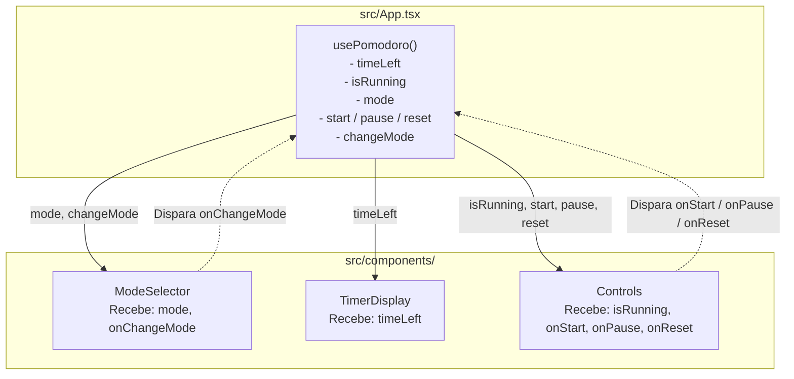

# 05. Integração da Aplicação: Conectando Estado e Componentes no App

Bem-vindo ao quinto passo do desenvolvimento do Pomodoro!

Até agora, você construiu todas as peças do quebra-cabeça de forma isolada e testada:
1. **`formatTime`**: a função pura de formatação.
2. **`usePomodoro`**: o cérebro que gerencia o estado e as regras de transição.
3. **`TimerDisplay`**: o mostrador visual do tempo.
4. **`Controls`**: a barra com as ações de iniciar, pausar e reiniciar.
5. **`ModeSelector`**: as abas para alternar entre Pomodoro, Descanso Curto e Descanso Longo.

Agora é o momento em que essas peças se conectam dentro do componente principal: o **`src/App.tsx`**.

---

## 1. O Papel do `App.tsx`: O Componente Orquestrador (*Container Component*)

Na arquitetura React, chamamos o `App.tsx` de **Container** ou **Orquestrador**. Ele não precisa se preocupar com detalhes visuais internos dos botões ou formatações de string. Sua responsabilidade é:
1. Invocar o hook de estado (`usePomodoro`).
2. Distribuir os dados (estado) para os componentes filhos como **props**.
3. Conectar os eventos de clique dos filhos às funções do hook.

### O Fluxo Unidirecional de Dados (*One-Way Data Flow*)



* **Os dados descem:** O estado gerenciado pelo `usePomodoro` desce em direção aos componentes filhos.
* **Os eventos sobem:** Quando o usuário clica em um botão, o evento sobe através dos callbacks (`onStart`, `onChangeMode`, etc.), acionando as funções do hook que atualizam o estado.

---

## 2. Limpeza do Boilerplate do Vite

O arquivo `src/App.tsx` atual ainda possui o código padrão gerado pelo Vite (com botões de contador, logos giratórios e links externos).

Para a integração do Pomodoro:
* Removeremos todo o JSX e estados antigos (`count`, logos, links).
* Estruturaremos uma marcação semântica limpa (por exemplo, dentro de um `<main className="app">` ou `<div className="pomodoro-container">`).
* Importaremos nossos 3 componentes visuais e o hook `usePomodoro`.

---

## 3. Testes de Integração com React Testing Library

Nos passos anteriores, fizemos **testes unitários**:
* No `Controls.test.tsx`, passamos funções falsas (`vi.fn()`) para ver se o botão chamava a prop.
* No `usePomodoro.test.ts`, chamamos as funções diretamente via `act()`.

Agora, em **`src/App.test.tsx`**, faremos **testes de integração**. Testaremos como o usuário real interage com o aplicativo completo na tela, sem mocks de funções internas!

### O que o Teste de Integração valida:

1. **Estado Inicial:**
   * A aplicação renderiza exibindo o tempo padrão (`25:00`).
   * O botão "Iniciar" está visível na tela.
   * O botão "Pausar" **não** deve estar visível inicialmente.

2. **Iniciar e Pausar o Cronômetro (Ciclo Real de UI):**
   * Ao clicar no botão "Iniciar", o botão "Iniciar" desaparece e o botão "Pausar" aparece no lugar dele.
   * Ao clicar no botão "Pausar", o botão "Iniciar" reaparece.

3. **Troca de Modos na Interface:**
   * Quando o usuário clica no botão "Descanso Curto", o mostrador do cronômetro muda para `05:00`.
   * Quando clica no botão "Descanso Longo", o mostrador muda para `10:00`.
   * Quando volta para o "Pomodoro", o mostrador volta para `25:00`.

4. **Reiniciar o Cronômetro:**
   * Ao clicar em "Reiniciar", o temporizador mantém o tempo padrão do modo atual.

---

## 4. Roteiro Prático de Execução

Recomendamos seguir o ciclo guiado:

### Passo 1: Escrever os Testes de Integração em `src/App.test.tsx`
Substitua o teste inicial do Vite pelos cenários de integração descritos acima:
* Renderize o `<App />`.
* Use `screen.getByRole` e `await user.click(...)` simulando o uso real.
* Execute `npm test` e veja os novos testes falharem (já que o `App.tsx` ainda não tem os componentes conectados).

### Passo 2: Montar a Integração em `src/App.tsx`
* Chame o hook: `const { timeLeft, isRunning, mode, start, pause, reset, changeMode } = usePomodoro();`
* Renderize os 3 componentes passando suas respectivas props:
  * `<ModeSelector mode={mode} onChangeMode={changeMode} />`
  * `<TimerDisplay timeLeft={timeLeft} />`
  * `<Controls isRunning={isRunning} onStart={start} onPause={pause} onReset={reset} />`
* Execute `npm test` e veja a suíte completa de integração passar!

### Passo 3: Verificação de Qualidade
```bash
npm test
npm run typecheck
npm run lint
```

---

## 🧠 Perguntas de Engenharia para Fixação

1. **Por que no teste de integração (`App.test.tsx`) nós NÃO usamos `vi.fn()` para as ações do cronômetro?**  
   *(Dica: pense no objetivo de um teste de integração vs. um teste unitário).*

2. **Se o `App.tsx` precisasse renderizar outro cronômetro totalmente independente na mesma tela, como o uso do custom hook `usePomodoro` facilitaria essa tarefa?**  
   *(Dica: pense no isolamento de instâncias do `useState`).*

3. **O que acontece com os componentes `TimerDisplay`, `Controls` e `ModeSelector` quando o `App.tsx` sofre uma re-renderização disparada pela mudança do `timeLeft`?**  
   *(Dica: pense no ciclo padrão de renderização de componentes filhos no React).*

---

## 🏁 Próximo Passo

Com o `App.tsx` totalmente integrado e testado:
* **Etapa 6 (O Coração do Timer):** Implementaremos o `useEffect` com `setInterval` dentro do `usePomodoro` para fazer os segundos finalmente diminuírem de verdade com o passar do tempo real!
