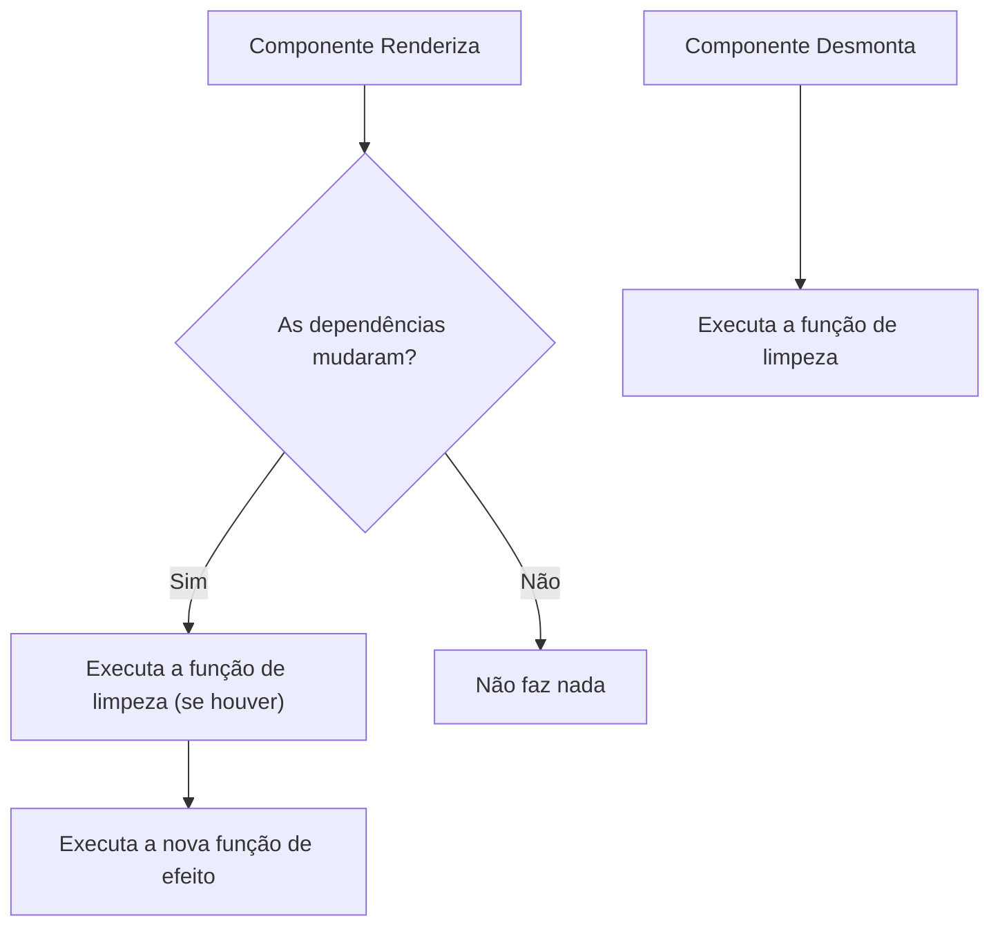

# 06. O Coração do Timer: Efeitos Colaterais com useEffect e setInterval

Bem-vindo ao sexto passo do desenvolvimento do nosso Pomodoro!

No passo anterior, você concluiu com maestria a integração no `src/App.tsx`: o estado e as ações do hook foram distribuídos para os componentes visuais, e todos os testes de renderização e alternância de botões passaram com 100% de sucesso.

Agora chegamos ao **coração do aplicativo**: fazer o tempo efetivamente passar segundo a segundo na tela quando o cronômetro estiver rodando.

---

## 1. O que são Efeitos Colaterais (*Side Effects*) no React?

No React, funções de componentes e custom hooks devem ser, por padrão, focadas em receber entradas (props e estados) e calcular saídas (JSX ou objetos).

Qualquer operação que precise conversar com sistemas ou APIs fora do ecossistema direto de renderização do React é chamada de **efeito colateral** (*side effect*). Exemplos clássicos:
* Timers do navegador (`setInterval`, `setTimeout`).
* Requisições HTTP (`fetch`).
* Ouvintes de eventos globais da janela (`window.addEventListener`).
* Manipulação direta do DOM ou armazenamento local (`localStorage`).

Para sincronizar com segurança o ciclo de renderização do React com esses sistemas externos, utilizamos o hook oficial: **`useEffect`**.

---

## 2. A Anatomia do `useEffect`

O `useEffect` aceita dois argumentos:
1. Uma **função de efeito**: o código que deve ser executado.
2. Um **array de dependências**: lista de variáveis que informam ao React quando esse efeito deve ser recalculado.



### O Perigo do Memory Leak e a Função de Limpeza (*Cleanup*)

Quando criamos um timer no navegador via `setInterval`, ele continuará rodando infinitamente em segundo plano, mesmo que o usuário pause o cronômetro ou mude de tela, a menos que o cancelemos explicitamente com `clearInterval`.

Se não cancelarmos timers anteriores, a cada renderização um novo intervalo será criado, acumulando múltiplos contadores rodando em paralelo e fazendo o tempo diminuir de forma acelerada ou desgovernada (o temido *memory leak*).

Por isso, o `useEffect` permite retornar uma **função de limpeza**:

```tsx
useEffect(() => {
  if (!isRunning) return;

  const timerId = setInterval(() => {
    // Código que roda periodicamente
  }, 1000);

  // Função de limpeza (cleanup): chamada antes do próximo efeito ou ao desmontar
  return () => {
    clearInterval(timerId);
  };
}, [isRunning]);
```

---

## 3. O Problema das Closures Antigas (*Stale Closures*)

Um dos erros mais comuns ao trabalhar com timers no React é tentar diminuir o estado assim:

```tsx
// ⚠️ CUIDADO: Problema de Closure Antiga!
setInterval(() => {
  setTimeLeft(timeLeft - 1); // `timeLeft` aqui pode ficar preso no valor inicial!
}, 1000);
```

Como o callback do `setInterval` foi criado no momento em que o efeito rodou, a variável `timeLeft` fica "congelada" com o valor daquele instante dentro da closure da função.

### A Solução Elegante: Atualização Funcional do Estado

Em vez de passar o novo valor direto, passamos uma função de callback para o atualizador do `useState`:

```tsx
// ✅ Atualização funcional: o React sempre nos entrega o valor mais recente (prev)
setTimeLeft((prevTime) => {
  if (prevTime <= 1) {
    // Chegou a zero: o que fazer?
    return 0;
  }
  return prevTime - 1;
});
```

Dessa forma, o timer não precisa de `timeLeft` na lista de dependências do `useEffect`, evitando que o efeito seja destruído e recriado a cada único segundo!

---

## 4. O Comportamento ao Chegar a Zero

O que deve acontecer quando o `timeLeft` atinge `0`?
1. O tempo não deve ficar negativo (deve parar em `0`).
2. O cronômetro deve parar de rodar automaticamente (`isRunning = false`).
3. O intervalo ativo deve ser encerrado.

---

## 5. Como Testar o Tempo com Vitest (*Fake Timers*)

Em testes automatizados, não podemos esperar 1 segundo ou 25 minutos de tempo real. Para isso, o Vitest fornece o recurso de **Fake Timers**:

* `vi.useFakeTimers()`: Congela o relógio real do sistema e assume o controle dos timers.
* `vi.advanceTimersByTime(1000)`: Avança o tempo virtualmente em 1000 milissegundos (1 segundo) instantaneamente!
* `vi.useRealTimers()`: Restaura o relógio real após os testes terminarem.

### Cenários a Adicionar em `src/hooks/usePomodoro.test.ts`:

1. **Decremento após 1 segundo quando rodando:**
   * Iniciar o timer (`start()`).
   * Avançar o relógio em 1 segundo (`vi.advanceTimersByTime(1000)`).
   * Verificar se `timeLeft` foi de `1500` para `1499`.
2. **Tempo não diminui quando pausado:**
   * Avançar 1 segundo com o timer parado.
   * Verificar se `timeLeft` continua em `1500`.
3. **Parada automática ao zerar:**
   * Ajustar o tempo ou avançar até zero e garantir que `isRunning` se torna `false`.

---

## 6. Roteiro Prático de Execução

### Passo 1: Escrever os Novos Testes no `src/hooks/usePomodoro.test.ts`
Adicione os cenários de passagem de tempo usando `vi.useFakeTimers()` e `vi.advanceTimersByTime(...)`. Execute `npm test` e veja esses testes falharem (já que o tempo ainda não decrementa).

### Passo 2: Implementar o `useEffect` em `src/hooks/usePomodoro.ts`
* Adicione o `useEffect` monitorando `isRunning`.
* Crie o `setInterval` de 1000ms apenas se `isRunning` for verdadeiro.
* Use a atualização funcional `setTimeLeft(prev => ...)` para decrementar e travar em 0.
* Retorne a função de limpeza com `clearInterval`.

### Passo 3: Verificação de Qualidade
```bash
npm test
npm run lint
```
Abra a aplicação no navegador com `npm run dev`, clique em "Iniciar" e veja os segundos finalmente contarem regressivamente em tempo real na sua tela!

---

## 🧠 Perguntas de Engenharia para Fixação

1. **Por que é perigoso esquecer de retornar o `clearInterval` na função de limpeza do `useEffect`? O que aconteceria se o usuário clicasse em "Iniciar", depois em "Pausar", e depois em "Iniciar" de novo?**
2. **Qual a vantagem técnica de usar a atualização funcional `setTimeLeft(prev => prev - 1)` em vez de colocar `timeLeft` no array de dependências do `useEffect`?**
3. **Se o usuário trocar de modo (por exemplo, de Pomodoro para Descanso Curto) enquanto o cronômetro estiver rodando, como o seu efeito deve se comportar?**

---

## 🏁 Próximo Passo

Após implementar o coração do timer:
* **Etapa 7 (Refinamento e Experiência do Usuário):** Alertas sonoros ou visuais ao zerar o tempo, persistência e estilização refinada!
