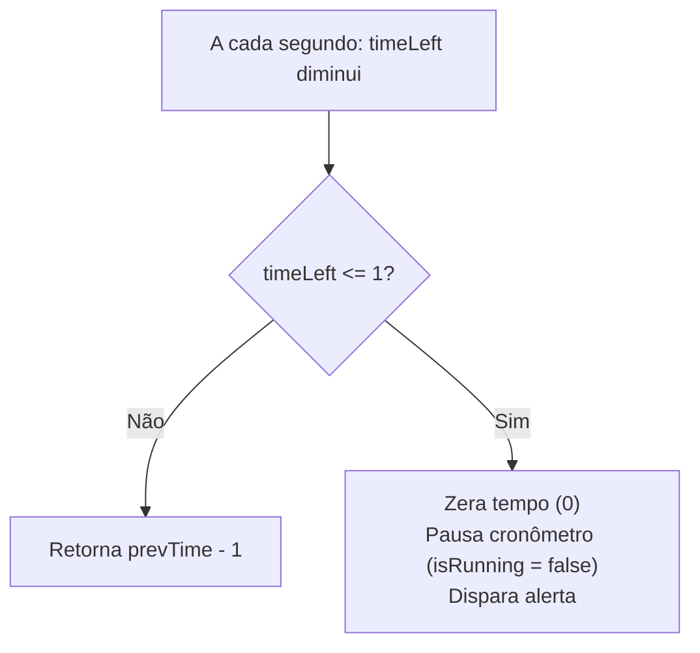

# 07. Refinamento: Conclusão do Ciclo, Notificações e Estilização

Bem-vindo ao sétimo passo do desenvolvimento do Pomodoro!

No passo anterior, você construiu o **coração do cronômetro**: implementou o `useEffect` com `setInterval`, evitou closures antigas com atualizações funcionais e garantiu a destruição limpa do timer.

Agora o aplicativo tem toda a sua mecânica básica funcionando. O objetivo desta etapa é transformar o protótipo funcional em um **produto polido, agradável e completo**, abordando a conclusão do ciclo, a experiência do usuário (UX) e a identidade visual (UI).

---

## 1. O Término do Ciclo: O que acontece quando o tempo chega a zero?

Na versão atual, o tempo para em `0`, mas a variável `isRunning` permanece como `true`. Em um aplicativo real de Pomodoro, o término do tempo precisa disparar ações concretas:

1. **Parada Automática:** O relógio deve pausar automaticamente (`isRunning = false`) para não consumir recursos em segundo plano.
2. **Sinalização do Término:** O usuário geralmente está trabalhando em outra tela ou focado em uma tarefa; portanto, ele precisa de um alerta evidente (sonoro e/ou visual) avisando que o bloco de foco terminou.



---

## 2. Feedback ao Usuário: Som e Título da Aba

### A. Alerta Sonoro no Navegador
O navegador permite tocar sons curtos utilizando a API nativa de áudio:

```ts
// Exemplo em outro contexto: tocando um áudio simples
const audio = new Audio('/alarme.mp3');
audio.play().catch(err => {
  // Navegadores modernos podem bloquear áudio se não houver interação prévia do usuário
  console.warn('Reprodução bloqueada pelo navegador:', err);
});
```

> [!NOTE]
> **Política de Autoplay dos Navegadores:** Para evitar barulhos indesejados, os navegadores só permitem tocar sons se o usuário já tiver clicado em algum elemento da página antes (como o botão "Iniciar").

### B. Título da Aba Dinâmico (`document.title`)
Uma excelente prática de UX para cronômetros é atualizar o título da aba do navegador para que o usuário veja a contagem mesmo estando em outra aba:
* Exemplo: `(24:50) Pomodoro`
* Quando o tempo acabar: `(00:00) Tempo esgotado! - Pomodoro`

---

## 3. Estilização Moderna e Acessível (UI & CSS)

No arquivo `src/App.css`, agora podemos desenhar uma interface limpa e centrada na usabilidade.

### Princípios Chave de Design para um Pomodoro:

1. **Hierarquia e Centralização:**
   - O aplicativo deve ficar centralizado na tela (usando `display: flex` ou `grid`).
   - O mostrador de tempo (`TimerDisplay`) deve ser o elemento visual de maior destaque (tipografia grande, em negrito e com alto contraste).

2. **Evitar o "Efeito Pulo" dos Números (`tabular-nums`):**
   - Fontes proporcionais comuns têm larguras diferentes para cada caractere (o número `1` é mais fino que o `8`). Quando o tempo corre, o texto pode tremer lateralmente.
   - **Solução CSS:** Utilizar `font-variant-numeric: tabular-nums;` ou uma fonte monoespaçada para que todos os dígitos tenham exatamente a mesma largura fixa.

3. **Indicação Clara de Estado Ativo:**
   - No `ModeSelector`, o botão do modo ativo possui `aria-pressed="true"`. Use esse seletor no CSS para dar destaque especial à aba selecionada:
     ```css
     button[aria-pressed="true"] {
       background-color: #e53e3e; /* Cor destacada */
       color: white;
     }
     ```

4. **Identidade Visual por Modo (Cores Temáticas):**
   - Um toque clássico do Pomodoro é mudar sutilmente a paleta de fundo ou de destaque dependendo do modo ativo:
     - **Pomodoro:** Vermelho / Coral (foco e energia).
     - **Descanso Curto:** Verde / Esmeralda (pausa e relaxamento).
     - **Descanso Longo:** Azul / Índigo (descanso prolongado).

---

## 4. Roteiro Prático de Execução

### Passo 1: Ajustar a Lógica de Parada no Hook (com TDD)
1. Escreva um teste no `src/hooks/usePomodoro.test.ts` que avança o tempo até zero e afirma que:
   - `timeLeft` é `0`.
   - `isRunning` tornou-se `false`.
2. Ajuste a implementação do `usePomodoro.ts` para parar a execução ao zerar.
3. Garanta que todos os testes continuem verdes.

### Passo 2: Estilizar a Interface (`src/App.css`)
1. Defina um layout centralizado e responsivo.
2. Estilize os botões com estados interativos (`:hover`, `:active` e `:focus-visible` para acessibilidade via teclado).
3. Ajuste o estilo do mostrador `TimerDisplay` para grande escala com `tabular-nums`.

### Passo 3: Feedback Visual/Sonoro (Opcional)
1. Adicione um arquivo de áudio curto em `public/` ou utilize o efeito de título da aba.
2. Dispare o aviso quando o tempo zerar.

---

## 🧠 Perguntas de Engenharia para Fixação

1. **Por que chamar `setIsRunning(false)` diretamente dentro do callback `setTimeLeft(prev => ...)` pode ser considerado uma má prática no React?**  
   *(Dica: pense na pureza das funções atualizadoras do `useState` e no modo estrito `StrictMode`).*

2. **Como a propriedade CSS `font-variant-numeric: tabular-nums` melhora a percepção visual do usuário em contadores regressivos?**

3. **Se você decidir sincronizar o `document.title` com o `timeLeft`, onde essa lógica deve morar? No componente `App.tsx`, no `TimerDisplay.tsx` ou em um efeito dedicado?**

---

## 🏁 Conclusão do MVP

Ao finalizar este passo, o seu Pomodoro Timer deixará de ser apenas um conjunto de componentes isolados e passará a ser uma aplicação completa, funcional, esteticamente agradável e pronta para ser usada no seu dia a dia de estudos!
